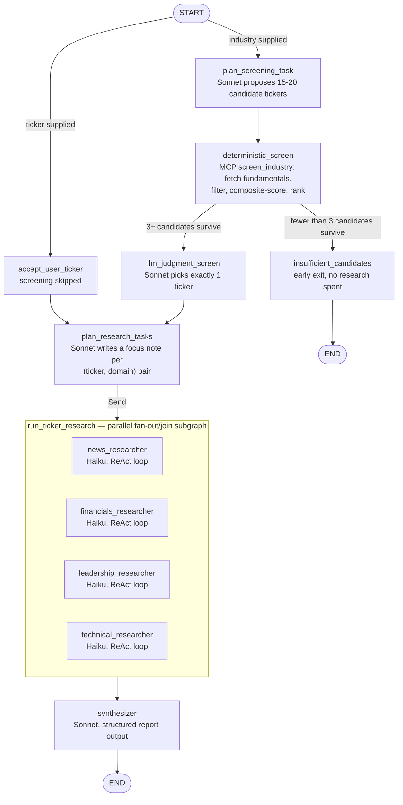

# Agentic AI Stock Researcher

## What this is

A multi-agent research system that turns "Regional Banks" or "JPM" into a single
citation-backed stock research report. It's built for someone doing the first pass of
equity research — an analyst, or an individual investor — who wants a grounded starting
point (real fundamentals, real news, real filings) instead of either a raw LLM guess or
an hour of manually pulling data from five different sites.

Given either an industry name or a specific ticker:

1. **Industry input**: screens the industry down to the single most undervalued stock,
   using a deterministic fundamentals-based composite score followed by an LLM judgment
   step. **Ticker input**: screening is skipped entirely and that ticker goes straight to
   step 2.
2. Runs a 4-domain deep-dive (news, financials, leadership, technical analysis) on that
   one ticker, in parallel, via a LangGraph subgraph.
3. Synthesizes the findings into one structured, citation-backed report with an overall
   recommendation, strengths, and risks.

Built with Python, LangGraph, LangChain, FastAPI, MCP, and Claude Code, with LangSmith
tracing and a lightweight eval harness. This is a v1 built for a weekend checkpoint, not
a production service — see [Tradeoffs & what's not production-ready](#tradeoffs--whats-not-production-ready)
below for what that means concretely.

## Architecture



Three required agent roles, wired as a real `StateGraph` (`app/graph/build.py`), not a
chain:

- **Planner** — `plan_screening_task` (proposes candidate tickers for an industry) and
  `plan_research_tasks` (writes a tailored focus note per ticker/domain pair), both in
  `agents/planner.py`.
- **Researchers** — 4 independent domain agents (`agents/researchers/`), each its own
  ReAct tool-calling loop, compiled once as an inner `StateGraph(TickerResearchState)`
  and invoked per run via `Send` (`app/graph/build.py:build_ticker_subgraph`). None reads
  another's output — each only writes to a shared `findings` reducer — so they run
  concurrently rather than as a chain.
- **Synthesizer** — `agents/synthesizer.py`, combines all 4 researchers' findings into
  one structured report with citations.

There are two conditional edges (`app/graph/routing.py`):

- `route_from_start` — routes on whether the caller supplied a ticker or an industry.
- `route_after_screen` — routes to `insufficient_candidates` (an early exit with no
  research spent) if fewer than 3 candidates survive the deterministic screen, otherwise
  to the LLM judgment step. Between those two, `agents/screener.py` also has a
  deterministic scoring function (`compute_composite_score`) with no LLM in the loop —
  +1 for each fundamental (P/E, P/B, debt/equity) that beats the industry median, +0.5 if
  the ticker pays any dividend (a bonus, not a filter, so REITs aren't unfairly
  penalized).

State is fully typed (`app/graph/state.py`): `ResearchState` for the outer graph,
`TickerResearchState` for the inner subgraph, `CandidateFundamentals` /
`DomainFinding` / `ResearchTask` as the shared record shapes.

## MCP integration

**Custom MCP server** (`tools/mcp_finance_server/`), built with the official `mcp` SDK's
`FastMCP`, exposing 4 tools:

| Tool | Purpose |
| --- | --- |
| `screen_industry(industry, candidate_tickers)` | Fetches Finnhub fundamentals for each candidate, filters by market cap ($300M+) and liquidity ($1M+ avg dollar volume), scores and ranks them. Tickers not in the cached NASDAQ universe are dropped before spending a Finnhub call on them. |
| `get_fundamentals(ticker)` | Current fundamentals (P/E, P/B, debt/equity, dividend yield, EPS, margins, 52-week range) for a single ticker. |
| `get_price_history(ticker, range)` | Daily OHLCV bars, backing the technical researcher's SMA/EMA/RSI/MACD indicators. |
| `get_company_news(ticker, from_date, to_date)` | Company news headlines for the news researcher. |

**Why a custom server, and why `screen_industry` takes `candidate_tickers` instead of
just `industry`**: the original design planned to fuzzy-match `industry` against NASDAQ's
public screener response, which used to include a per-ticker `industry` field. Live
testing showed NASDAQ dropped that field — only a coarse ~12-bucket `sector` remains, as
a server-side filter, not a queryable per-row value. So "which tickers plausibly belong
to this industry" moved upstream to an LLM proposal step (`plan_screening_task`), and
`screen_industry` now does the part that should stay deterministic: real fundamentals
fetch, filtering, and composite scoring for a given ticker list. Full writeup in
`CLAUDE_CODE_NOTES.md`.

**Official Fetch MCP server** (`mcp-server-fetch`, pip-installed, launched via
`python -m mcp_server_fetch`) — used for unstructured content the 4 finance tools don't
cover: news article bodies, IR/leadership pages, and 10-K/10-Q excerpts.

**SEC EDGAR submissions JSON** (`tools/edgar.py`) is called directly via `httpx`, *not*
through an MCP server — it's already structured JSON, not a page needing text
extraction, so routing it through Fetch MCP would add a hop for no benefit. The custom
finance server alone satisfies the "≥1 MCP-backed tool" requirement; Fetch MCP does real,
load-bearing work on top of that for the unstructured sources.

**Runtime wiring** (`tools/mcp_client.py`): both servers are stdio subprocesses spawned
exactly **once**, in FastAPI's `lifespan` (`app/main.py`), held open for the app's
lifetime via an `AsyncExitStack`. This matters because
`MultiServerMCPClient.get_tools()` spawns a fresh subprocess *per tool call* by default —
documented behavior, not a bug, but wrong for this use case — so
`open_persistent_mcp_sessions()` opens one long-lived session per server instead.

## API

| Route | Method | Notes |
| --- | --- | --- |
| `/research` | POST | Pydantic-validated body: exactly one of `industry` or `ticker`. Returns `202` + `job_id` immediately; the graph runs in a background asyncio task. |
| `/jobs/{job_id}` | GET | Job status (`pending` / `running` / `done` / `failed`) and the final report once done. `404` for an unknown `job_id`. |
| `/healthz` | GET | Trivial sync `200` liveness probe — zero I/O, so it's defensibly sync while `/research` is async. |

**Sync vs. async**: `/research` is async and returns immediately with a `job_id` rather
than blocking for the multi-minute pipeline (`app/api/routes.py`, `app/jobs.py`) — a
synchronous request/response would tie up the connection for as long as ~12 parallel
tool-calling researcher agents take to finish. The job store is a plain in-memory dict
keyed by `job_id`; it doesn't survive a restart and requires running uvicorn with a
single worker (the dict isn't shared across processes) — an accepted v1 tradeoff, not a
production design.

## Setup (local)

```bash
uv sync
cp .env.example .env   # fill in ANTHROPIC_API_KEY, FINNHUB_API_KEY, LANGCHAIN_API_KEY, SEC_EDGAR_USER_AGENT
uv run python scripts/refresh_nasdaq_cache.py
uv run uvicorn app.main:app --reload
```

Then open `http://localhost:8000/`. A `/research` call takes several minutes end to end
(multiple sequential LLM calls plus 4 parallel tool-calling researcher agents) — poll
`/jobs/{job_id}` rather than expecting an instant response.

## Running with Docker

```bash
docker build -t agentic-ai-stock-researcher .
docker run -p 8000:8000 --env-file .env agentic-ai-stock-researcher
```

Then open `http://localhost:8000/`, same as the local setup. The image bundles the
NASDAQ/SEC ticker caches (`data/*.json`) so it starts cleanly even with no network access
to those (unofficial, undocumented) endpoints — verified by building fresh and running
with `--network none` and confirming `/healthz` still returns `200`. API keys are read
from the environment at `docker run` time via `--env-file`, never baked into the image.

The container runs the venv's `uvicorn` binary directly rather than through `uv run` —
`uv run` re-syncs the environment on every invocation, which would silently pull the
`dev` dependency group (pytest, respx) back in over the network at every container start,
undoing the `--no-dev` install done at build time.

## Evaluation

`eval/golden_set.json` has 6 author-written cases chosen to stress different parts of the
pipeline: a clean baseline (Regional Banks), the direct-ticker bypass path (JPM), a
cyclical industry, a "value trap" risk case (Specialty Retail), a deliberately hostile
case that should hit the `insufficient_candidates` path (Genomic/Biotech Research), and a
different valuation convention to check the scoring formula isn't overfit to the baseline
(REITs).

```bash
uv run uvicorn app.main:app &
uv run python eval/run_eval.py --base-url http://localhost:8000
```

`eval/run_eval.py` POSTs each case to `/research`, polls to completion, and checks the
structural shape of the result (exactly 1 final candidate, ≥3 citations across its
findings, all 4 domains present, or a valid `insufficient_candidates` outcome), then
prints a pass-rate summary and writes `eval/last_run_results.json`.

> Eval results: not yet run against live APIs as of this commit — each case costs real
> Anthropic spend (see Tracing below) and takes several minutes, so it's run manually
> rather than in CI. Run the command above and paste the resulting pass rate here before
> submitting.

## Tracing

LangSmith tracing is "free" here in the sense that nothing in this codebase calls the
LangSmith SDK directly — `langchain-core` reads the `LANGCHAIN_*` env vars
(`.env.example`) and instruments every `ChatAnthropic` call and MCP tool call
automatically. See `traces/README.md` for the expected trace shape (planner → screener →
4 parallel researcher ReAct loops → synthesizer) and for capturing a full-run screenshot.

> LangSmith trace screenshot: not yet captured as of this commit (a prior verification
> run hit an Anthropic credit limit partway through) — see `traces/README.md` for the
> steps to capture `traces/regional_banks_run.png` once a full run completes.

## Tradeoffs & what's not production-ready

- **In-memory job store, single worker.** Jobs are lost on restart and can't be scaled
  across processes. A real deployment would need a durable store (Redis/Postgres) and a
  proper task queue.
- **Industry → ticker sourcing is LLM-proposed, not sourced from a structured taxonomy.**
  NASDAQ's public screener dropped its per-ticker `industry` field after the original
  design was scoped. Every industry-input report carries a `data_provenance_note` flagging
  this, and the frontend exposes the full ranked candidate shortlist (not just the winner)
  so a user can see what else was considered. All fundamentals/research data itself is
  still real (Finnhub/Yahoo Finance/SEC EDGAR), only the candidate *list* is LLM-sourced.
- **The build originally targeted the top 3 undervalued stocks with one comparative
  report; it was narrowed to a single ticker mid-build** (see `PLAN.md`'s Context
  section) — `llm_judgment_screen` and `fan_out_to_ticker_research` both still operate on
  a `final_candidates` list for that reason, even though exactly one entry is ever
  selected today.
- **No prompt caching.** Each researcher's ReAct loop resends its full growing
  conversation — including fetched article/page text — on every turn. Per
  `traces/README.md`, 98.7% of tokens in a measured real run were input tokens, not
  output — this is the actual cost driver, not model "thinking." Worth revisiting past a
  checkpoint context.
- **Price history uses Yahoo Finance's unofficial chart API**, not a documented,
  key-based provider — Finnhub's free tier lacks historical candles, and Financial
  Modeling Prep's free tier restricts history to a small symbol whitelist that excluded
  most real (non-mega-cap) tickers tested. Same "unofficial, needs a browser User-Agent"
  caveat as the NASDAQ screener endpoint.

## Built with Claude Code

See `CLAUDE_CODE_NOTES.md` for the full workflow notes: what was built with it, notable
corrections mid-build, and concrete prompt examples.

## Loom walkthrough

_Link to be added: architecture defense, live demo, and failure-mode walkthrough._
